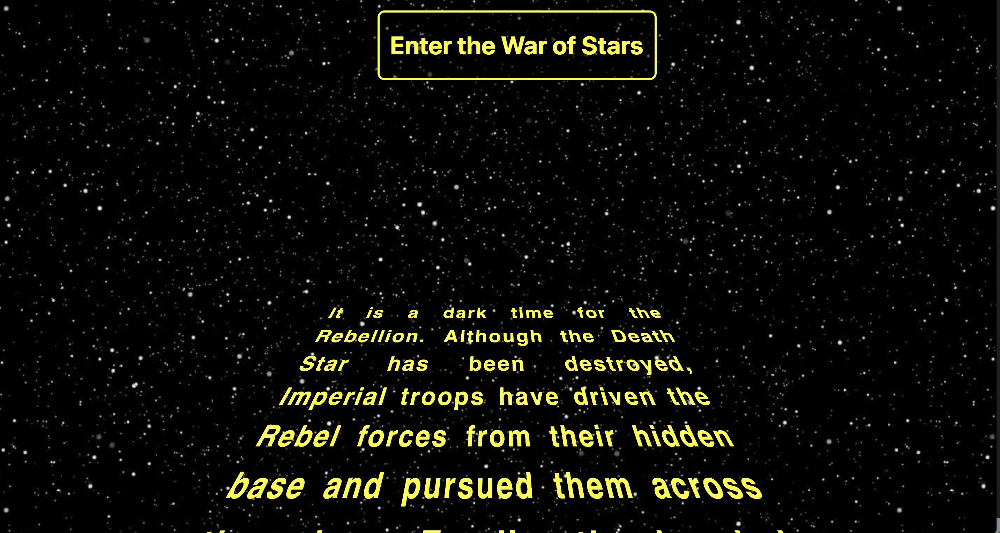
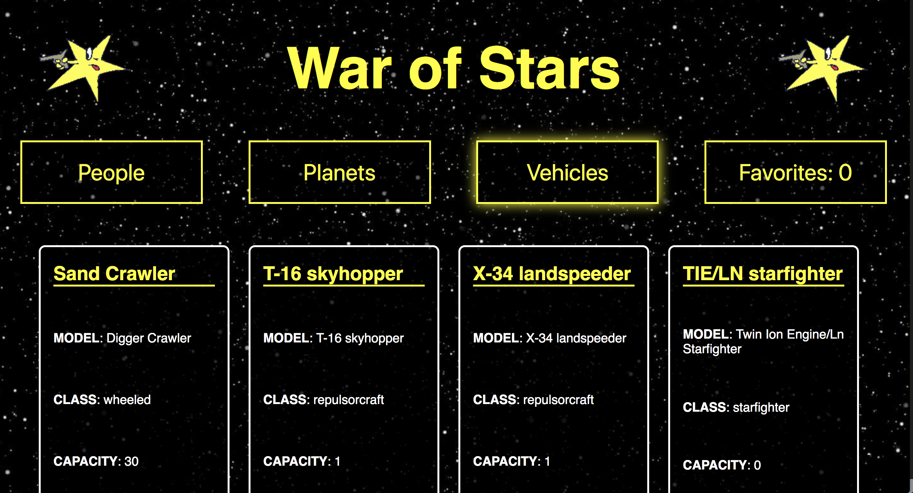

## SWapiBox

## Description

This project was built around pulling data from the Star Wars api, swapi. It's an application that grabs information about the characters, planets and vehicles that I'm told are in the films.  I haven't seen the film's so I decided to style the project as I imagine the theme to be.
The application was built using React. The goal was to practice making async api requests, building react components and testing React with mock fetch calls.

This project was bootstrapped with [Create React App](https://github.com/facebookincubator/create-react-app).

